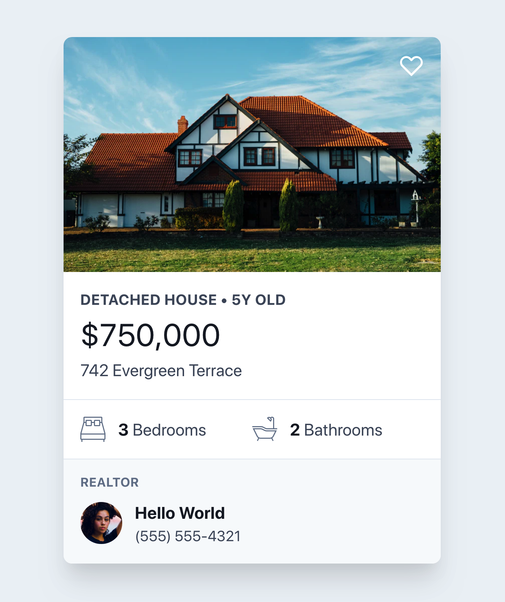

# Assignment: Property card

1. *Fork* the repository, then *clone* the new repository to your local computer.
2. OPTIONAL: Take the [sample composition](./sample.png) below and annotate the elements and layers using the graphic software of your choice. Consider the visual representation of each later or component, while also noting the element type and providing an appropriate class name (or classes) for each, at minimum.
3. Recreate the card using semantic HTML and CSS, using the techniques learned to this point about information architecture, design systems, and best practices in HTML/CSS.
    - For the salesperson's image, use your own photo, or select images from a service online, like [Diverse UI](https://diverseui.com/).
    - For the "heart" icon, use an emoji, or an icon pack like [Font Awesome](https://fontawesome.com/) or [Material Icons](https://fonts.google.com/icons).
    - Feel free to modify any aspects of the design, including fonts, colours, content, etc.
5. Consider where a button that says "Learn more" would be placed. Design and code it to link to the current page, but imagine it would be used to link to the full property listing some time in the future.
6. Once complete, replicate the entire card to create 8-12 total cards, modifying the information within each to make them all look like unique property listings. 
    - For at least half of the items, increase the number of listed amenities (for example, "2 Car Garage", "Finished Basement", etc) so that some cards are taller than others.
8. Layout all of the cards in a responsive grid (like the results of search) so that the cards are each displayed in the best possible dimensions, regardless of the viewport width (be mindful of box shadows that overlap elements in an unnatural way).
9. Add a "header" and "footer" to the document, branding it as a real estate brokerage using your own custom logo.
    - Consider adding a menu, or other items that would make the site feel real (social media icons, etc). Use existing sites or concepts as insiration.
10. BONUS: Design a set of components to help search and filter properties (these are non-functional, just make it look like they would filter the results).

## Sample composition

